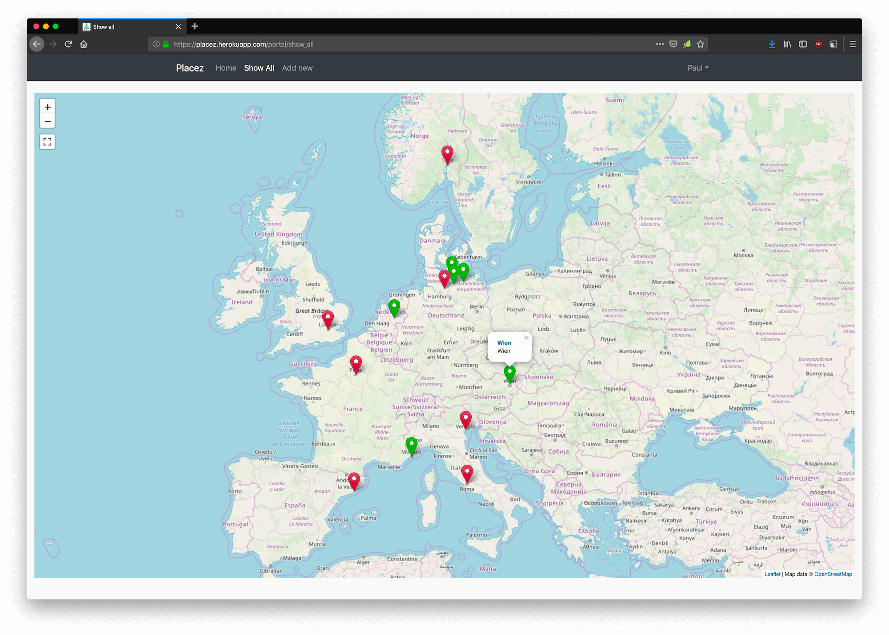
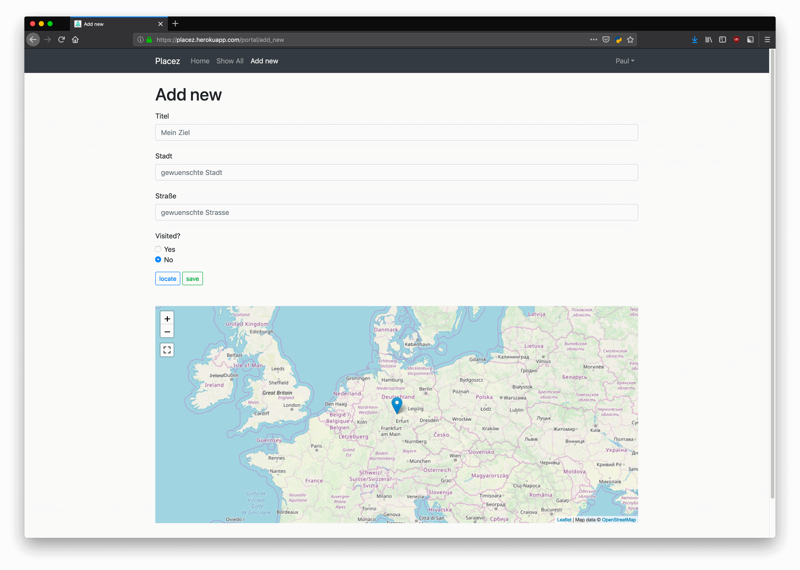

# Placez

> Manage all your places that you want to visit or already visited



## Test it out

* [Demo](https://placez.herokuapp.com/) – Try this demo and test by yourself. Either create a new user or try demo and pw helloworld

## Getting Started

These instructions will get you a copy of the project up and running on your local machine for development and testing purposes. See deployment for notes on how to deploy the project on a live system.

### Prerequisites

What things you need to install the software and how to install them:

```
Python 2.7
```
Download and install under [Python](https://www.python.org/downloads/) for Windows or use [homebrew](https://brew.sh/) on a Mac.

### Installing

Get your development env running with these steps below:

```
pip install -r requirements.txt
python manage.py migrate
python manage.py runserver
```

Now open your fav browser and visit [localhost](https://localhost:8000)

## Running the tests

You can run tests with the django test framework:

```
python manage.py test
```

## Deployment

Deploy on [heroku](https://www.heroku.com/) with [django-heroku](https://devcenter.heroku.com/categories/working-with-django).

## Built With

* [Django](https://www.djangoproject.com/) - The web framework for perfectionists with deadlines
* [pip](https://pypi.org/project/pip/) - The tool for installing Python packages
* [Bootstrap](https://getbootstrap.com/) - The most popular HTML, CSS, and JavaScript framework
* [Leaflet](https://leafletjs.com/) - An open-source JavaScript library for mobile-friendly interactive maps
* [OpenStreetMap](https://www.openstreetmap.org/) - OpenStreetMap is a collaborative project to create a free editable map of the world

## Authors

* **Paul Bellmann** - *Initial work* - [paulbellmann](https://github.com/paulbellmann)

See also the list of [contributors](https://github.com/paulbellmann/ojuice/contributors) who participated in this project.

## License

This project is licensed under the MIT License - see the [LICENSE.md](LICENSE.md) file for details.

